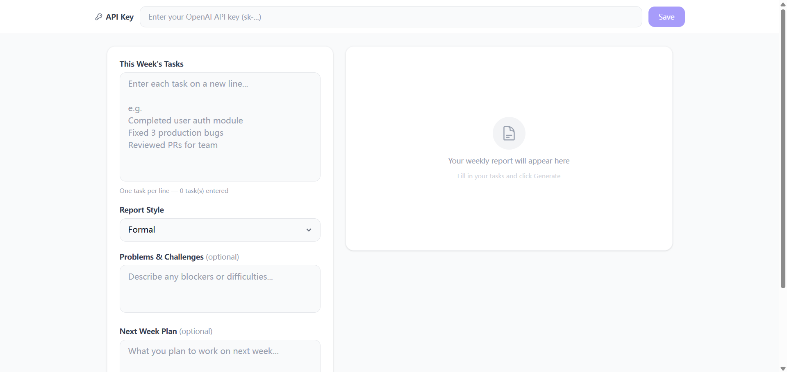

# 📊 AI Weekly Report Generator

A modern web application that generates professional weekly reports using OpenAI's GPT-3.5-turbo. Input your tasks, choose a style, and get a polished markdown report in seconds.



## Features

- **Three Report Styles** — Formal, Concise, and Highlights-focused
- **OpenAI Powered** — Uses GPT-3.5-turbo for natural, professional writing
- **Markdown Output** — Rich formatting with headings, lists, bold, and more
- **One-Click Copy** — Copy the generated report to clipboard instantly
- **Local API Key Storage** — Your key stays in your browser's localStorage
- **Responsive Design** — Works on desktop and mobile
- **Zero Backend** — Pure frontend, no server needed

## Tech Stack

| Technology | Purpose |
|------------|---------|
| React 18 | UI framework |
| Vite | Build tool |
| Tailwind CSS v4 | Styling |
| OpenAI API (gpt-3.5-turbo) | Report generation |

## Prerequisites

- **Node.js** >= 18
- **OpenAI API Key** — Get one at [platform.openai.com/api-keys](https://platform.openai.com/api-keys)

## Installation

```bash
# 1. Clone the repository
git clone https://github.com/YOUR_USERNAME/ai-weekly-report.git
cd ai-weekly-report

# 2. Install dependencies
npm install

# 3. Start the dev server
npm run dev
```

The app will open at `http://localhost:5173`.

## Usage

1. **Set your API Key** — Enter your OpenAI API key in the top bar and click Save. It's stored only in your browser.
2. **Enter tasks** — Type your weekly tasks in the left panel, one per line.
3. **Choose style** — Select Formal, Concise, or Highlights from the dropdown.
4. **Optional fields** — Add problems/challenges and next week's plan for a more complete report.
5. **Generate** — Click the Generate button and wait a few seconds.
6. **Copy or Regenerate** — Copy the markdown to your clipboard, or regenerate if you want a different version.

## Configuration

You can customize the API endpoint and model via environment variables:

```bash
# .env (copy from .env.example)
VITE_OPENAI_API_KEY=sk-your-key-here      # Optional — set in UI instead
VITE_OPENAI_BASE_URL=https://api.openai.com/v1  # Default OpenAI endpoint
VITE_OPENAI_MODEL=gpt-3.5-turbo           # Model to use
```

**Note:** Environment variables prefixed with `VITE_` are exposed to the browser. Only use them for non-sensitive config. Store your API key in the UI for safety.

## Project Structure

```
src/
├── App.jsx                      # Root component
├── main.jsx                     # Entry point
├── index.css                    # Global styles + Tailwind
├── constants.js                 # Style options and prompts
├── components/
│   ├── ApiKeyBar.jsx            # API key input bar
│   ├── InputPanel.jsx           # Task input and controls
│   ├── OutputPanel.jsx          # Report display and actions
│   └── LoadingSpinner.jsx       # Loading animation
└── utils/
    └── openai.js                # OpenAI API helper
```

## License

MIT
